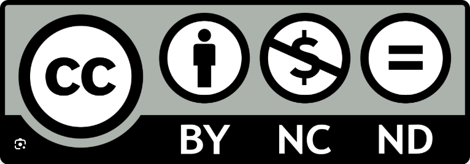

# Sprengenbeken ("spring brooks")

A few years ago, some people from the Bekenstichting and I made a knowledge clip about "sprengenbeken", a specific type of man-made brook found on the slopes of glacial push moraines in the Netherlands. 
In the video we explain (in Dutch) what makes these spring brooks special, how they were formed, where their water comes from and what is necessary to keep them.

## Video

The [video](https://sprengenbeken.nl/wat-is-een-sprengenbeek/) is available at the website of the Bekenstichting.

### Copyright

The video is published under the Creative Commons BY-NC-ND licence. This means that you are free to use it with the following restrictions:
- Attribution — You must give appropriate credit , provide a link to the license, and indicate if changes were made . You may do so in any reasonable manner, but not in any way that suggests the licensor endorses you or your use.
- NonCommercial — You may not use the material for commercial purposes .
- NoDerivatives — If you remix, transform, or build upon the material, you may not distribute the modified material.

## Figures

The schematic figures that are used in the video can be found in this folder.

### Copyright

The figures are published under the Creative Commons BY-SA licence. This means that you are free to use them with the following restrictions:
- Attribution — You must give appropriate credit , provide a link to the license, and indicate if changes were made . You may do so in any reasonable manner, but not in any way that suggests the licensor endorses you or your use.
- ShareAlike — If you remix, transform, or build upon the material, you must distribute your contributions under the same license as the original.

The CC-BY-SA watermark is included in the figure. Please don't remove it.

